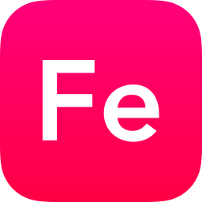

  

<h1 align="center">Iron</h1>

  
  
  

> Iron is a new programming language that emphasizes speed, safety, and usability. It is extremely easy to learn and extremely difficult to use incorrectly. It is built with Rust and works on any major platform.
